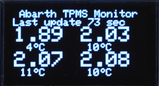
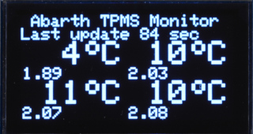
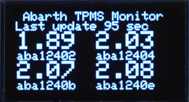
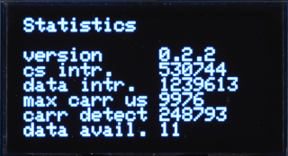
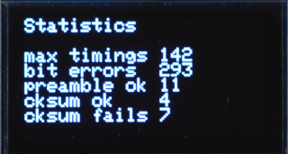

# MODULES

[DISP](#disp)<br>
[OIL](#oil)<br>
[RGB](#rgb)<br>
[TPMS](#tpms)<br>

## DISP

[Inhalt](#modules)<br>

Display

```
$ usbget -c DISP
D=0 M=1 S=2 L=15

$ usbget -s DISP -p "M=1;S=1"
```

* D<br>
  Device: OLED Display Chip
  
  0 = SH1106<br>
  1 = SDD1306
  
* M<br>
  Mode: Im mode 1 with zwischen Screen 0 und einem weiteren Screen umgeschaltet.
  
  0 = Nur einen Screen anzeigen<br>
  1 = Wechsel zwischen 2 Screens<br>
  2 = Wechsel zwischen allen Screens
  
* S<br>
  Screen:
  
  0 = Druck und Temperatur<br>
  <br>
  
  1 = Temperatur und Druck<br>
  <br>

  2 = Druck und Sensor ID<br>
  <br>

  3 = Statistiken 1<br>
  <br>
    
  4 = Statistiken 2<br>
  
  
* L<br>
  Last update: Automatisches ausblenden der "Last update" Zeile.
 
  Sekunden: Die Zeile "Last update xx sec" wird nur angezeigt wenn die Zeit größer als der eingestellte Wert in Sekunden ist. 

## OIL

[Inhalt](#modules)<br>

Öldruck und Temperatur

Das Module hat keine einstellbaren Parameter.

## RGB

[Inhalt](#modules)<br>

RGB LED

Für das RGB Modul können die Farbwerte gesetzt werden.

```
$ usbget -s RGB -p "R=100" -p "G=50" -p "B=50"
$ usbget -s RGB -p "R=100;G=50;B=50"

$ usbget -c RGB
R=100 G=50 B=50
```

## TPMS

[Inhalt](#modules)<br>

Tire Pressure Monitoring System

```
$ usbget -c TPMS
0=00000000
1=00000000
2=00000000
3=00000000
0 ID=aba12401 T=2.0 P=2.22 S=10
1 ID=aba1240e T=19.0 P=2.25 S=10
2 ID=aba12402 T=18.0 P=2.26 S=9
3 ID=aba12403 T=15.0 P=1.99 S=7
4 ID=00000000 T=0.0 P=0.00 S=0
5 ID=00000000 T=0.0 P=0.00 S=0
6 ID=00000000 T=0.0 P=0.00 S=0
7 ID=00000000 T=0.0 P=0.00 S=0
8 ID=00000000 T=0.0 P=0.00 S=0
9 ID=00000000 T=0.0 P=0.00 S=0
10 ID=00000000 T=0.0 P=0.00 S=0
11 ID=00000000 T=0.0 P=0.00 S=0
```

ID=Sensor T=Temperatur P=Pressure S=Score

### Score wird wie folgt berechnet:
Wird ein Datensatz für einen Sensor empfangen, erhält der Sensor einen Bonus
von 10 Punkten. Alle 20 sek. wird jedem Sensor ein Punkt abgezogen.<br>
Die Sensoren sind nach Punktestand sortiert.

Im Arduino code sind 12 Slots für Sensoren reserviert.

Mit usbget -s TPMS -p "0=xxxxxxxx" können die IDs für die ersten 4 Sensoren gesetzt werden. Diese Slots sind für diese
Sensor IDs reserviert. Werden keine Sensoren gesetzt, oder ALLE sensor IDs geloscht z.Bsp mit

```
usbget -s TPMS -p "0=00000000;1=00000000;2=00000000;3=00000000"
```

dann werden alle 12 slots gleich behandelt und nach Punktestand sortiert.

